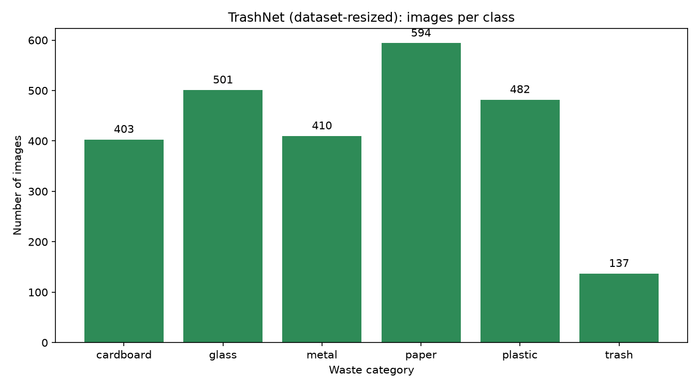
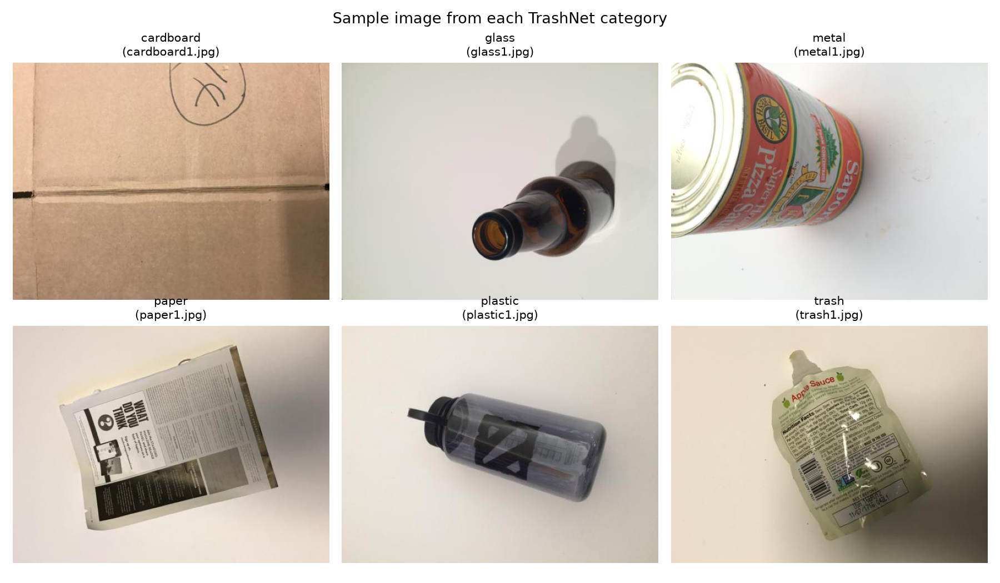
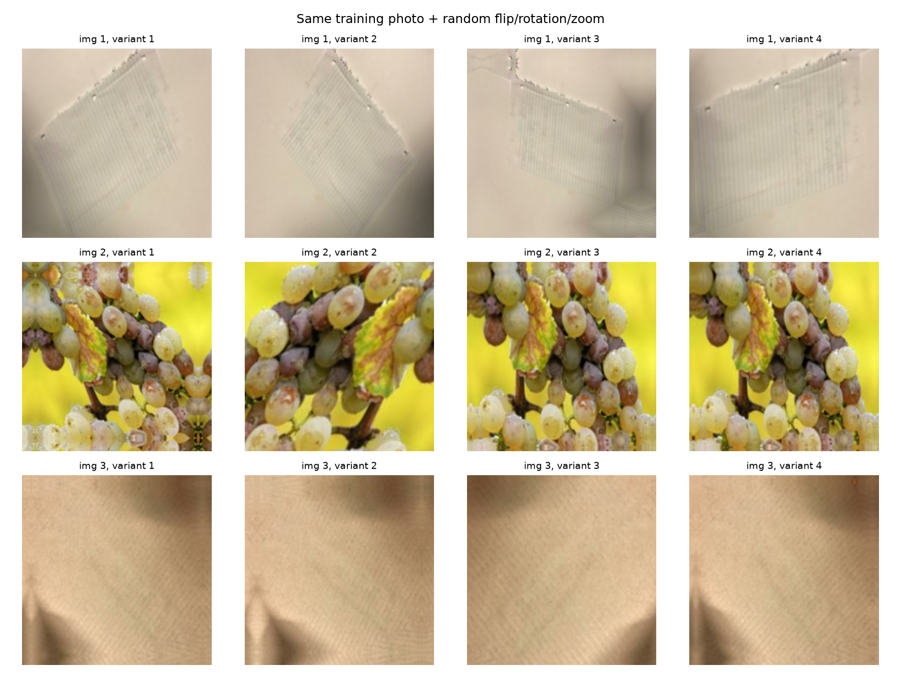

# Waste Segregation Using Image Classification

Computer-vision system that accepts a photo of a waste item and predicts its
category — **plastic, paper, metal, or organic** — with a confidence score,
served through a Streamlit web app.

**Headline result (sealed test set, n = 362): accuracy 92.8%, macro-F1 0.924.**
Stage-A-only baseline was 92.3% / 0.918, so fine-tuning added +0.5pp.

## Problem statement

Mixed household waste makes recycling expensive: sorting is manual, slow, and
error-prone. An image classifier at the bin (or in a phone app) can route each
item to the right stream — plastic, paper, metal, or organic — cutting
contamination and landfill load.

## Objectives

1. Build a 4-class waste image classifier with transfer learning.
2. Reach honest, reproducible test metrics (no validation-peeking).
3. Ship a usable web demo: upload → category + confidence.
4. Document every step so the full ML workflow is learnable and repeatable.

## Dataset sources and class mapping

| Our class | Source | Images |
|---|---|---:|
| Plastic | TrashNet `plastic/` | 482 |
| Paper | TrashNet `paper/` + `cardboard/` (same fibre family) | 997 |
| Metal | TrashNet `metal/` | 410 |
| Organic | Mendeley DOI 10.17632/n3gtgm9jxj.3, first 500 sorted (1 dupe removed → 499) | 499 |
| — | TrashNet `glass/` + `trash/` **excluded** (glass is not organic; trash is mixed) | — |
| **Total** | | **2,388** |

- TrashNet (Thung & Yang, Stanford CS229 2016): 2,527 verified images, 0 unreadable.
  Repo licence MIT; dataset requires citation (see References).
- Organic set (Nnamoko et al. 2022): 13,880 organic photos, **CC BY 4.0** —
  free to use with attribution (see References). Our copy holds 9,591 files.
- Split: stratified **70/15/15** (train 1,670 / val 356 / test 362), seed 42.
  Exact-duplicate files removed by MD5; audit found 0 files shared across
  classes and 0 files in more than one split. Manifest: `data/splits/`
  (manifest.csv + split_info.json).


*Raw TrashNet `dataset-resized`: 6 classes, 2,527 images (`explore_dataset.py`).*


*One sample photo from each TrashNet category — clean, single-object,
white-background style.*


*Prepared dataset: per-class train/val/test counts, 2,388 images total
(`plot_prepared_distribution.py`, disk scan cross-checked vs the manifest).*

## Environment

| Component | Version | Note |
|---|---|---|
| Python (venv) | 3.12.10 | matches Colab runtime |
| TensorFlow | 2.20.0 | CPU-only locally (no NVIDIA GPU on laptop) |
| Keras | 3.15.1 | `.keras` model format |
| NumPy / Pillow / Pandas | 2.5.3 / 12.3.0 / 3.0.6 | |
| Matplotlib / scikit-learn | 3.11.2 / 1.9.1 | figures + metrics + stratified split |
| Streamlit | 1.64.0 | web app |
| Google Colab | T4 GPU | real training runs here (~10–25 min) |

## Installation (Windows, VS Code)

```powershell
cd waste-segregation
py -3.12 -m venv .venv
.venv\Scripts\python -m pip install -r requirements.txt
```

## Workflow (10 phases)

| # | Phase | Script | Output |
|---|---|---|---|
| 1 | Inspection + setup | — | `.venv/`, `requirements.txt`, `data/dataset-resized/` (2,527 imgs) |
| 2 | Exploration | `src/explore_dataset.py` | counts, `class_distribution.png`, `sample_images.png` |
| 3 | 4-class split | `src/data_preparation.py` | `data/processed/` (1,670/356/362), manifest, `class_names.json` |
| 4 | Preprocessing | `src/preprocessing.py` | verified [-1,1] batches, `augmentation_preview.png` |
| 5 | Training | `src/train.py` + Colab notebook | `waste_classifier.keras`, histories |
| 6 | Evaluation | `src/evaluate.py` | `evaluation.json`, curves, confusion matrix |
| 7 | Save model | — | `models/` artefacts |
| 8 | Web app | `app.py` | Streamlit demo |
| 9 | Testing | AppTest suite | 4/4 labels, error paths, OOD behaviour |
| 10 | Docs | README + `docs/project_report.md` | this file + full report |

## Preparing the data

```powershell
.venv\Scripts\python src\data_preparation.py --organic-src data\organic-raw
```

Flags: `--organic-limit` (default 500, for balance), `--seed` (default 42),
`--train/--val/--test` ratios (default 0.70/0.15/0.15). Copies only — originals
are never moved or modified. Deterministic: same seed → byte-identical manifest.

## Preprocessing and augmentation

Every image, train and inference alike: RGB → resize 224×224 → official
`mobilenet_v2.preprocess_input` ([0,255] → [−1,1], the scale ImageNet weights
expect). Training images additionally get random horizontal flips, small
rotations, and ±20% zoom — **train only**, so validation/test scores stay
honest. The pipeline lives in `src/preprocessing.py` and the app imports the
same function, so the two can never drift apart.


*Same training photo under random flip/rotation/zoom — the model learns the
object, not the exact pixels.*

Verify it any time:

```powershell
.venv\Scripts\python src\preprocessing.py
```

## Training the model

Architecture: MobileNetV2 (ImageNet, `include_top=False`, frozen) +
GlobalAveragePooling2D + Dropout(0.3) + Dense(4, softmax). Adam optimizer,
sparse categorical cross-entropy, sklearn class weights
(metal 1.455 … paper 0.599) to counter the ~2× paper majority.

| Stage | Base | LR | Epochs | Trainable |
|---|---|---:|---:|---|
| A — feature extraction | frozen | 1e-3 | ≤25 | 5,124 params (head only) |
| B — fine-tuning | last 30/154 layers unfrozen | 1e-5 | ≤20 | head + base tail |

EarlyStopping (restore best) + ModelCheckpoint + ReduceLROnPlateau throughout.

Fast smoke test (CPU, ~5 min, proves the code runs — not real training):

```powershell
.venv\Scripts\python src\train.py --smoke
```

Real training in Colab (`notebooks/waste_classification.ipynb`, T4 GPU):

1. `Compress-Archive -Path data\processed -DestinationPath processed_colab.zip -Force`
2. Upload `processed_colab.zip`, `train.py`, `preprocessing.py`, `class_names.json`.
3. Verify counts → train (`--epochs-a 25 --epochs-b 20`) → verify 4 output files.
4. Download one `waste_outputs.zip`; back up to Drive (Colab disks wipe on reconnect).
5. Place `.keras` files → `models/`, history JSONs → `outputs/`.

## Evaluating

```powershell
.venv\Scripts\python src\evaluate.py
```

Scores `stage_a_best.keras` and `waste_classifier.keras` on the sealed test
set. Writes `outputs/evaluation.json` (accuracy, macro-F1, per-class
precision/recall/F1, confusion matrix for both models),
`outputs/figures/training_curves.png`, `outputs/figures/confusion_matrix.png`.

## Running the app

```powershell
.venv\Scripts\streamlit run app.py
```

Upload JPG/JPEG/PNG → preview → **Predict** → category, confidence, and
per-class bars. The model loads once (`st.cache_resource`). A sub-60% score
raises a caution flag — it is *not* a reliable non-waste detector, because a
4-class model always picks one of its classes. Missing model/map files produce
a clear recovery message instead of a traceback.

## Results (actual, test set n = 362)

| Class | Precision | Recall | F1 | Support |
|---|---:|---:|---:|---:|
| metal | 0.889 | 0.903 | 0.896 | 62 |
| organic | 0.987 | 0.987 | 0.987 | 76 |
| paper | 0.952 | 0.927 | 0.940 | 151 |
| plastic | 0.855 | 0.890 | 0.873 | 73 |

Accuracy **0.9282**, macro-F1 **0.9237** (Stage A alone: 0.9227 / 0.9180).


*Train vs validation accuracy/loss across Stage A then B (dashed line):
fast convergence, no divergence; the Stage-B train dip-and-recover is the
normal fine-tune signature; early stopping halted before val degraded.*


*Final model, sealed test set (rows = true, columns = predicted). Errors are
material-adjacent: metal↔plastic (shiny cans vs bottles), paper↔plastic
(wrappers/films); organic is 75/76.*

Validation accuracy read 0.961 — the ~3pp val/test gap is expected selection
bias (checkpoints are chosen on val); **0.928 is the unbiased figure** to quote.

## Testing performed

- Pipeline: deterministic manifests (identical hash across runs), 0 files
  leaking across splits, 0 cross-class byte-duplicates.
- Training smoke test on CPU: both stages, both `.keras` files, histories.
- App (headless AppTest): 4/4 correct labels (metal 99%, organic 98%, paper
  100%, plastic 81%), corrupt file → friendly error, missing model → clear
  recovery message, noise image → graceful forced guess, no crashes.

## Reproduce the pipeline

```powershell
.venv\Scripts\python src\explore_dataset.py      # counts + figures
.venv\Scripts\python src\data_preparation.py --organic-src data\organic-raw
.venv\Scripts\python src\preprocessing.py        # batch/range/augment check
.venv\Scripts\python src\evaluate.py             # test metrics + figures
```

## Limitations and future scope

- Clean white-background training photos vs messy real-world bins (domain gap);
  augmentation helps, real-bin photos would help more.
- No reliable out-of-distribution detection (a toy photo still gets a label).
- Paper ≈2× the smallest class; class weights contain it but more metal/plastic
  photos would be better.
- Mild source label noise in the organic set.
- Next: real-bin photo collection, OOD/reject option, lighter model export
  (TFLite) for on-device sorting, top-2 display when scores are close.

## Project structure

```
waste-segregation/
  app.py  requirements.txt  PROGRESS.md
  src/         explore_dataset.py  data_preparation.py  preprocessing.py
               plot_prepared_distribution.py  train.py  evaluate.py
  notebooks/  waste_classification.ipynb   (Colab GPU training)
  models/      waste_classifier.keras  stage_a_best.keras  class_names.json
  data/        dataset-resized/  organic-raw/  processed/  splits/
  outputs/     figures/  evaluation.json  history_stage_*.json
  docs/        project_report.md
```

## References

- Thung & Yang (2016), TrashNet. GitHub `garythung/trashnet` (MIT code);
  dataset: HuggingFace `garythung/trashnet`. Please cite the repository.
- Nnamoko, Barrowclough & Procter (2022), "Solid Waste Image Classification
  Using Deep CNN", *Infrastructures* 7(4):47. doi:10.3390/infrastructures7040047.
  Dataset (CC BY 4.0): doi:10.17632/n3gtgm9jxj.3 (via Kaggle
  `techsash/waste-classification-data`).
- Howard et al. (2018), "MobileNetV2: Inverted Residuals and Linear
  Bottlenecks", arXiv:1801.04381.
