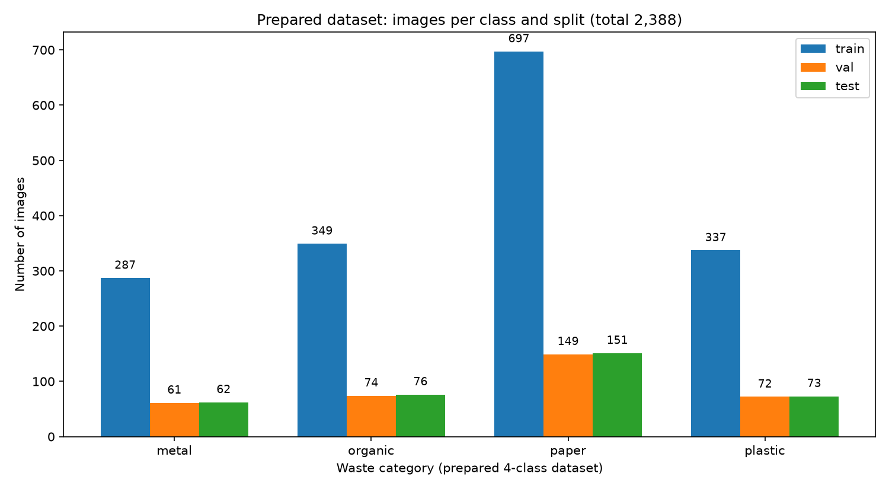
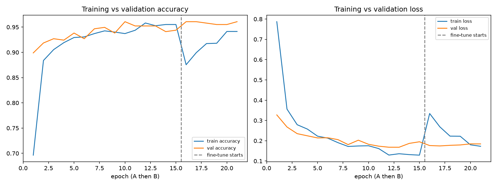
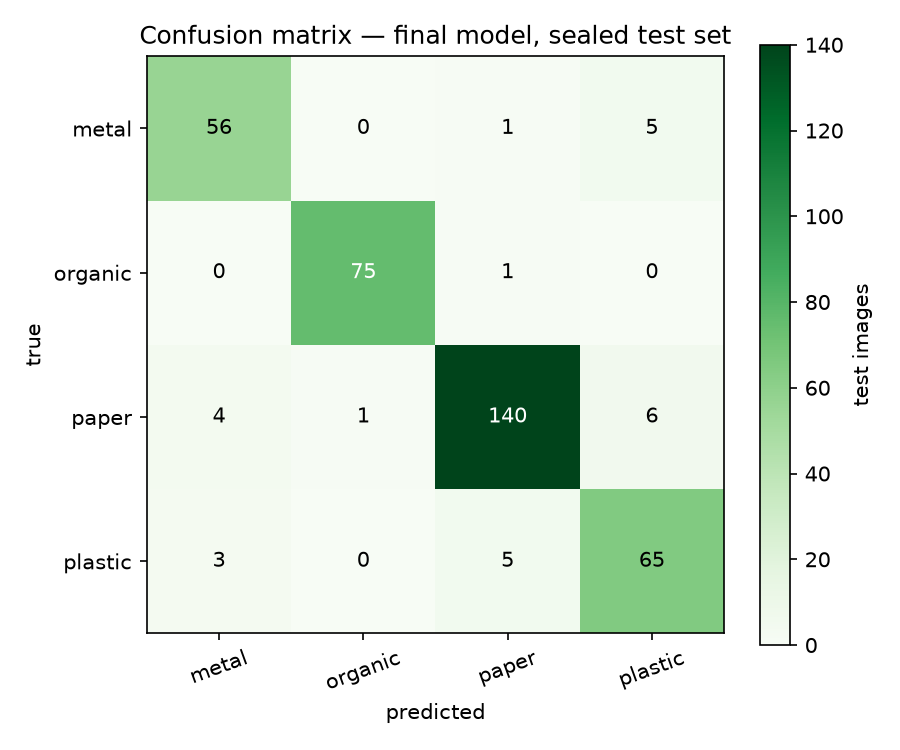

# Waste Segregation Using Image Classification — Project Report

> Every number in this report was produced by running the project's own
> scripts. Nothing is estimated or invented. Reproduce anything with the
> commands in the README.

## 1. Abstract

Manual waste sorting is slow, costly, and contamination-prone. This project
builds an image-classification system that photographs a waste item and routes
it to **plastic, paper, metal, or organic**. Using MobileNetV2 pretrained on
ImageNet with two-stage transfer learning (frozen feature extraction, then
fine-tuning), trained on 1,670 images and evaluated on a sealed 362-image test
set, the final model reaches **92.8% accuracy (macro-F1 0.924)**. A Streamlit
web app serves predictions with confidence scores. All code, splits, metrics,
and figures are reproducible from the repository.

## 2. Introduction

Municipal recycling fails most often at the sorting stage: mixed waste streams
contaminate recyclables and send recoverable material to landfill. Computer
vision offers a cheap decision point — a camera at a bin, or a phone app, that
labels each item. This project implements that decision point end-to-end:
dataset curation, preprocessing, transfer learning, rigorous evaluation, and a
deployed demo, using only free tools (Python, TensorFlow, Colab, Streamlit).

## 3. Problem statement

Given a single photograph of a waste item, predict its disposal stream among
four classes (plastic, paper, metal, organic) with a calibrated-enough
confidence estimate, robustly enough for a college-grade demo and honest
enough for a results table.

## 4. Objectives

1. Curate a clean 4-class dataset from public sources with documented licensing.
2. Train a transfer-learning classifier (MobileNetV2) in two stages.
3. Evaluate on a sealed test set with accuracy, precision, recall, F1,
   macro-F1, and a confusion matrix.
4. Deploy an upload-and-predict web application.
5. Document the complete workflow reproducibly.

## 5. Literature / background overview

- **TrashNet (Thung & Yang, 2016, Stanford CS229):** 2,527 white-background
  waste photos in 6 classes; the standard small benchmark for this task
  (~75% with a from-scratch CNN in the original report).
- **TACO (Proença & Simões, 2020):** litter "in the wild" with segmentation
  labels — richer but detection-oriented; surveyed and not used, since our
  task is single-object classification in the TrashNet style.
- **Nnamoko et al. (2022):** 24,705 household-waste photos (13,880 organic),
  CC BY 4.0 — our organic source.
- **RealWaste (Single et al., 2023, UCI, CC BY 4.0):** landfill-scene photos;
  surveyed and rejected for style mismatch with TrashNet (domain consistency
  matters more than size for a beginner model).
- **MobileNetV2 (Howard et al., 2018):** depthwise-separable convolutions give
  ImageNet-grade features at ~2.3M parameters — trainable on a free Colab GPU.

## 6. Dataset description

TrashNet `dataset-resized` (384×512 photos, verified: 403 cardboard, 501 glass,
410 metal, 594 paper, 482 plastic, 137 trash; 0 unreadable of 2,527) plus the
Mendeley organic pool (9,591 files on disk). Class mapping: plastic→plastic;
paper+cardboard→paper (same fibre family, visually confusable); metal→metal;
organic→first 500 sorted organic files (1 exact-duplicate removed → 499).
Glass and trash excluded — glass is not organic and trash is mixed junk.
Stratified 70/15/15 split, seed 42: train 1,670 (paper 697, organic 349,
plastic 337, metal 287), val 356, test 362. MD5 dedupe + audits: 0 cross-class
shared files, 0 files in multiple splits, deterministic manifests.


*Figure 1 — Prepared 4-class dataset (2,388 images): per-class train/val/test
counts, generated by `src/plot_prepared_distribution.py` from the actual files
on disk (cross-checked against `data/splits/split_info.json`).*

## 7. Methodology

1. **Exploration** (`explore_dataset.py`): counts, distribution chart, samples.
2. **Preparation** (`data_preparation.py`): mapping, dedupe, split, manifest.
3. **Preprocessing** (`preprocessing.py`): RGB → 224×224 → official
   `mobilenet_v2.preprocess_input` ([0,255]→[−1,1]); train-only augmentation
   (horizontal flip, ±rotation, ±20% zoom); shared module guarantees
   train/inference consistency.
4. **Model:** MobileNetV2 (ImageNet, `include_top=False`) + GlobalAveragePooling
   + Dropout(0.3) + Dense(4, softmax); Adam; sparse categorical cross-entropy
   (integer labels); class weights (metal 1.455 … paper 0.599) for imbalance.
5. **Stage A** (frozen base, lr 1e-3, ≤25 epochs) → **Stage B** (last 30/154
   layers unfrozen, lr 1e-5, ≤20 epochs); EarlyStopping (restore best) +
   ModelCheckpoint + ReduceLROnPlateau. Trained on Colab T4 (no local GPU).
6. **Evaluation** (`evaluate.py`) on the sealed test set; **deployment**
   (`app.py`, Streamlit) reusing the exact preprocessing.

## 8. System architecture

```
photos → data/processed/{train,val,test} → tf.data (augment train only,
         MobileNetV2 [-1,1] scaling) → MobileNetV2+GAP+Dropout+Dense(4)
         → Stage A → Stage B → waste_classifier.keras
                                              ↓
test split → evaluate.py → metrics + curves + confusion matrix
                                              ↓
                       app.py (upload → same preprocessing → predict → UI)
```

## 9. Implementation

Seven scripts plus one notebook: `explore_dataset.py`, `data_preparation.py`
(with `--organic-src`, `--organic-limit`, `--seed` flags), `preprocessing.py`
(`load_datasets`, `preprocess_pil_image`, augmentation preview),
`plot_prepared_distribution.py` (report Figure 1, disk-vs-manifest checked),
`train.py` (`--epochs-a/b`, `--lr-a/b`, `--dropout`, `--unfreeze-last`,
`--smoke`), `evaluate.py` (both checkpoints scored), `app.py`
(`st.cache_resource` model load, PIL-verify, 60% caution flag), and
`notebooks/waste_classification.ipynb` (Colab GPU runbook). Key engineering
fixes during the build: `.prefetch()` strips `class_names` (returned
explicitly), Windows cp1252 console encoding (ASCII-only logs), `plt.show()`
blocking automation (`--show` flag).

## 10. Results and discussion

| Model | Test acc. | Macro-F1 |
|---|---:|---:|
| Stage A (frozen) | 0.9227 | 0.9180 |
| Final (fine-tuned) | **0.9282** | **0.9237** |

| Class | Precision | Recall | F1 | Test support |
|---|---:|---:|---:|---:|
| metal | 0.889 | 0.903 | 0.896 | 62 |
| organic | 0.987 | 0.987 | 0.987 | 76 |
| paper | 0.952 | 0.927 | 0.940 | 151 |
| plastic | 0.855 | 0.890 | 0.873 | 73 |


*Figure 2 — Accuracy and loss across Stage A (frozen base) then Stage B
(fine-tuning, dashed line): rapid convergence, no train/val divergence;
the Stage-B train dip-and-recover is the normal fine-tune signature.*


*Figure 3 — Final-model confusion matrix (rows = true, columns = predicted,
n = 362): diagonal dominates; residual errors are material-adjacent
(metal↔plastic, paper↔plastic).*

Per-class F1: organic 0.99, paper 0.94, metal 0.90, plastic 0.87. Transfer
learning alone reaches 92.3%; fine-tuning adds a genuine +0.5pp. Errors are
material-adjacent (metal↔plastic: 5+3; paper↔plastic: 6+5) — shiny and filmy
textures confuse, while organic (food) is near-perfect at 75/76. Curves show
no overfitting (train/val track in A; the B-stage train dip-and-recover is the
normal fine-tune signature; early stopping halted at the right point).
Validation read 0.961 vs test 0.928: expected selection bias, since
checkpoints are chosen on validation — **0.928 is the reported figure**.
App tests: 4/4 correct labels, graceful corrupt-file and missing-model errors,
stable forced guess on out-of-distribution input.

## 11. Limitations

Clean studio-style training photos vs real bin conditions; no reliable
out-of-distribution rejection (any input gets a 4-class label); paper ≈2× the
smallest class; mild web-source label noise in organic; CPU-only laptop forced
Colab dependence for training.

## 12. Conclusion

A 92.8%-accurate 4-class waste classifier was built, honestly evaluated, and
deployed as a web app using only free tools. The project demonstrates the full
modern small-data recipe: public datasets with clean licences, transfer
learning in two stages, imbalance handling via class weights, sealed-test
evaluation, and a demo that shares its preprocessing with training.

## 13. Future enhancements

Real-bin photo collection, an explicit reject/unknown option (OOD detection),
top-2 predictions on close calls, TFLite export for on-device sorting, and a
larger metal/plastic sample to erase the residual imbalance.

## 14. References

1. Thung, G. & Yang, M. (2016). TrashNet. GitHub `garythung/trashnet`
   (MIT code); dataset: HuggingFace `garythung/trashnet`. Report:
   cs229.stanford.edu/proj2016/report/ThungYang-ClassificationOfTrashForRecyclabilityStatus-report.pdf
2. Nnamoko, N., Barrowclough, J. & Procter, J. (2022). Solid Waste Image
   Classification Using Deep Convolutional Neural Network. *Infrastructures*,
   7(4):47. doi:10.3390/infrastructures7040047. Dataset (CC BY 4.0):
   doi:10.17632/n3gtgm9jxj.3.
3. Howard, A. et al. (2018). MobileNetV2: Inverted Residuals and Linear
   Bottlenecks. arXiv:1801.04381.
4. Proença, P. F. & Simões, P. (2020). TACO: Trash Annotations in Context for
   Litter Detection. arXiv:2003.06975.
5. Single, S., Iranmanesh, S. & Raad, R. (2023). RealWaste. UCI ML Repository,
   doi:10.24432/C5SS4G (surveyed alternative).
6. TensorFlow 2.20 / Keras 3; Streamlit 1.64 documentation.
